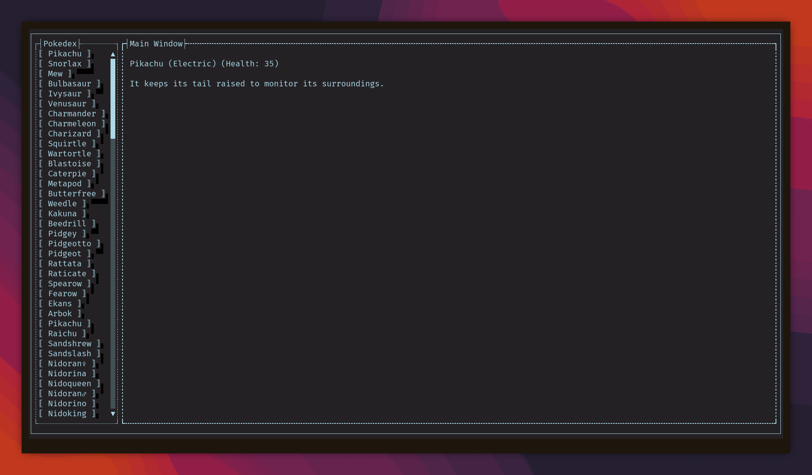

# Pokete

Pokete is a Pokedex written in Terminal.Gui

<p align="center">
	
</p>

## Features
- Buttons for the Pokemons
- Easily accessible thanks to being a terminal app
- Flexible, uses JSON for the infos, can add more pokemons and more details if wished.

## Needs:
.NET 10

## Build/Run
### Linux
``` bash
cd ~/pokete
dotnet publish pokete.csproj -c Release -r linux-x64 --self-contained true -p:PublishSingleFile=true -p:PublishTrimmed=true
cd bin/Release/net10.0/linux-x64/publish
./pokete
```
If you want, you can add `pokete` and `pokeInfos.json` to a directory that's in your PATH, so that you can access this app by simply typing `pokete` in your terminal.

## Note
The JSON file was AI GENERATED. Because Pokedex JSON files I found on the internet had too much information for what I wanted. Please make few changes to the source code and replace the JSON file with something like [this](https://github.com/Purukitto/pokemon-data.json/blob/master/pokedex.json) if you wish.
